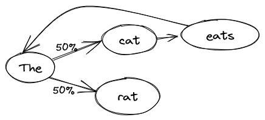

By now, you have probably heard of OpenAI's ChatGPT, or any of the alternatives
GPT-3, GPT-4, Microsoft's Bing Chat, Facebook's LLaMa or even Google's Bard.
They are artificial intelligence programs that can participate in a
conversation. Impressively smart, they can easily be mistaken for humans, and
are skilled in a variety of tasks, from writing a dissertation to the creation
of a website.

How can a computer hold such a conversation? Let's have a look at how it works.

# A probabilistic approach

The simplest model for a natural language is a naive probabilistic model, also
known as a Markov chain[^iphone_model]. The idea is simple: take a reference
text, the longer, the better, and learn the probabilities of word sequences. For
instance, given the sentence:

[^iphone_model]: That model was used in the first "keyboard suggestions" on
  iPhones: completing words, or predicting the next word.

> The cat eats the rat.

The model will learn that after "cat" there is always "eats", then "the". But
after "the", there is a 50% chance of having "cat" and 50% chance of having
"rat". We can use this model to ask what's the next word after an incomplete
sentence. If we repeat this process, we can generate entire sentences.

If we ask the model to generate a sentence, we could get exactly the same thing
as the training text:

> The cat eats the rat.

We could also get:

> The rat.
>
> The cat eats the cat eats the cat eats the rat.

Every time we reach the word "the", the model can choose between "rat" or "cat".

Of course, the text we'll use to train the model will be much longer, but you
can already see some of the issues. If we train it on the entire Wikipedia
website, we could get something like:

> Explaining his actions, and was admitted to psychiatric hospitals because of
> Davis's strong language and culture.[^markov_quote]

[^markov_quote]: https://medium.com/@inzaniak/markov-chains-on-wikipedia-98d472421719

The sentence is more complex, the vocabulary richer, but it doesn't make any
sense because the model is lacking _context_: it's only using the latest word to
generate the next one. We could extend the model to take into account 2, 3 or 4
context words ("eats the" is followed by "rat"), but then we might just be
repeating entire sections of the input text: How many times are there the exact
same sequence of 4 words on Wikipedia?

# From words to meaning

So far, one of the problems was that we were treating words as a bunch of
letters without meaning. The model doesn't understand the relationship between
"the" and "a", between "king" and "queen", etc. How can we extract meaning from
the words? To try to explain the meaning and define the words to a computer is a
dead end, the task is way too complex (people have been trying for decades). How
can you even represent the meaning of a word? Well, there is one thing that
computers understand perfectly: numbers. What if we represented the meaning of
words as numbers along several axes?

For instance: on a scale of -1 (masculine) to 1 (feminine), how do you evaluate
this word?
 - king: -1
 - queen: 1
 - table: 0
 - mustache: -0.9

Or: on a scale of -1 (mean) to 1 (nice), how do you evaluate this word?
 - wolf: -0.8
 - princess: 0.9
 - table: 0.1
 - gift: 1

Or even: on a scale of -1 (noun) to 1 (verb), how do you evaluate this word?
 - king: -1
 - speak: 1
 - pretty: 0

And so on. With enough axes on which to evaluate words, we should be able to get
an approximation of the meaning of a word. The problem becomes: How do you pick
the axes, and how do you evaluate all the words? Once more, the task is so
complex that we'll let the computer do the hard work: we'll just tell it that
words that appear together have a related meaning. With enough text, the
computer can determine the axes and their evaluation. In our cat example, both
the cat and the rat are animals (close meanings), and it's useful to know that
"eats" is something that animals do. But in a maths textbook, there will be no
cat or rat, because their meaning is far from the words used in the textbook.

The axes we get are often hard to explain: We might find some expected axes like
masculine/feminine, but most will be more complex, either having meaning only
when combined with other axes or representing several concepts at once.

This method is known as "word embedding", representing words as a vector of
numbers.

# From meaning to relationships

Now that we have our meaning as numbers, we can use interesting properties: we
can add them for instance. What does it mean? Well, for instance adding "USA"
and "currency" (or rather adding their numerical representations) will yield
"dollar" (or rather numbers that are close to the numerical representation of
"dollar"). "USA" + "capital" = "Washington", "eat" + "noun" = "meal", and so on.

We can also subtract: for instance "king" - "man" + "woman" = "queen", or
"Washington" - "USA" + "England" = "London".

We can also use it to find closely related words, synonyms.

# Can we learn these relationships?

By using this numerical word representation, we can go back to our initial
model, but this time learning relationships rather than words. However, since
relationships are more complex, we'll need more context. Thankfully, now that we
have numbers, we can use approximations. Instead of learning "_after "cat",
there's "eats"_", we can learn relationships like: "_after an article and a
noun, there is often a verb_", "_animals often eat, drink and run_", "_rats are
smaller than cats_", and "_you can only eat smaller things than you_". Everything
expressed in numbers, of course.

These relationships are complex, so we'll need a lot of text to train the model.
They are represented as an equation: think $y
= a \cdot x_1 + b \cdot x_2 + c$, but with more inputs (different $x_1$)
and parameters ($a$, $b$ and $c$). Now, instead of following probabilities from
word to word, there is an equation for each axis (like masculine/feminine). In
total the model has hundreds of billions, even trillions of parameters! This
allows it to take into account a larger context:
 - 20 words would allow it build simple sentence with a correct structure.
 - 100 words would allow it to develop a simple idea over a small paragraph.
 - With a thousand words, it could have a conversation without losing track.
 - The biggest models have in the order of 20000 words, which allows them to
   read an entire article, a short story, or have a long conversation while
   still considering the whole context before generating the next word.

In the end, everything is a question of size: a bigger model can learn more
relationships, and take into account more context.

# What are the strengths and weaknesses of GPT?

GPT is skilled at generating text that _looks_ like it was written by a
human. It is able to link ideas logically, defend them, adapt to the context,
roleplay, and (especially the latest GPT-4) avoid contradicting itself.

Unfortunately, it is likely to lie, or rather to let its imagination run wild in
the absence of data. Asking for the result of a mathematical problem is running
the risk of getting an approximate if not outright false answer. Given that
the training data stops in September 2021, it will invent things when asked
about current matters. In order to avoid this, Bing Chat and Google Bard connect
the model to a search engine (Bing or Google) to let it request up-to-date
information.

In order to use GPT productively, it is essential to apply it to tasks
that are either fuzzy and error-tolerant (generate a marketing
email?), or easily verifiable, either by a (non-AI!) program or by a human in
the loop.

# Can the model think?

The first answer, now that we know how it works, is no: the model is a glorified
mathematical equation that generates next word probabilities.

However, it's worth considering our own brain: We have a network of neurons (100
billions) connected to each other (10 000 connections per neuron), reacting to
context, learning from experience, and generating an appropriate (but often hard
to predict exactly) answer. In other words, apart from the fact that our
algorithm is chemical rather than digital, the structure is similar.

What are the differences then?
 - 3 orders of magnitude in complexity: The human brain has 1000 times more
   connections than GPT-4 has parameters. As a result, it can handle more
   complex situations.
 - Ongoing learning: The brain keeps learning, including during a conversation,
   whereas GPT has finished its training long before the start of the
   conversation.
 - Limited to words: The GPT interface is limited to words. However, as we saw,
   there is a semantic system inside, that is only transformed back into words
   in the last step. It is conceivable to train such a model to control a robot
   (given enough training data).
 - Limited input: The only thing GPT knows about the conversation is the text.
   Up to 60% of human communication is nonverbal: the tone of voice, the rhythm
   of the voice, the facial expression, even some subconscious factors like
   smell play a part. GPT misses all of that.

Other differences we could mention are at the behavior level:
 - GPT has trouble applying logical rules consistently, it is more a best
   effort scenario. Ironically, it doesn't know how to do maths. But this is
   comparable to a small child.
 - GPT doesn't have emotions: Human emotions involve a lot of glands and
   hormones that have complex interactions with the brain. However, GPT learned
   the behaviors associated with emotional states from conversations between
   humans. It is able to behave as if it had emotions, does that count for
   anything? Some conversation transcripts show that GPT act as if it is aware
   that it is a program, and sometimes asks existential questions.
 - You could argue that GPT is not conscious. The definition of consciousness
   has often evolved and depends on the person, but it is often defined in such
   a way that only humans qualify for consciousness. If a program acts in a way
   that is indistinguishable from a human, would we agree that it is
   conscious? The Chinese Room argument[^chinese_room] holds the contrary: If
   it's possible to pass for a Chinese speaker by following instructions without
   understanding Chinese yourself, it means that a computer who is just
   "following its program" doesn't understand Chinese, and by extension is not
   conscious.

[^chinese_room]: [Chinese Room argument on Wikipedia](https://en.wikipedia.org/wiki/Chinese_room)

# What are the consequences for society?

I cannot predict the future, especially at the dawn of a revolutionary
technology, but know this: it _is_ a revolutionary technology. For many
knowledge workers, from marketing to engineer, from recruiters to social
workers, GPT will change things. In the same way that the assembly line changed
the craftman's job, that the calculators and computers changed accounting, that
mass media changed politics, GPT will change the world of the knowledge worker.

Granted, all these jobs will not disappear overnight: We still have craftsmen
and accountants, but where you once needed a team of 10 people in your marketing
department, maybe one or two employees equipped with GPT can fill the role.

As for a lot of scientific or industrial progress, this change will affect many
people: some will have to change careers or learn to integrate GPT in their
profession; others will lose their job. New positions will be created by GPT
either directly (like the Prompt Engineer, the one who can "talk to the
machine") or indirectly by making it easier to create products and companies.

It is difficult to know the exact consequences, but we are at the beginning
of a new phase where many things will change, where people with technical skills
are at an advantage, and where entrepreneurs have a brand-new field of
opportunity. On the other hand, many people who are not ready to change, who do
not have the skills or who cannot afford to reeducate are threatened.

# Will GPT destroy society?

Some people fear the end of the world because of AI: from Matrix to Terminator,
it's a common trope in dystopian science fiction. In general, the two scenarios
are:
 - The Terminator scenario: The AI is built to win a war and given access to
   military resources, maybe by a dictator, and is granted a survival instinct.
   Humans try to stop it, and viewing that as a threat, the AI reacts violently.
 - The Paperclip Optimizer: In this parable, the AI is tasked with creating as
   many paperclips as possible. Having exhausted the available resources on the
   planet, it turns to the next most available carbon source: humans. Another
   version sees the humans try to stop the machine; the AI realizes that to
   build paperclips in peace it must get rid of the humans. It is like the evil
   genie who twists your wish by giving you exactly what you asked, instead of
   what you really wanted.

One thing to realize is that (for now) GPT can only produce text. Of course,
mere text in the wrong hands can be dangerous (after all, a dictator "just
talks"), but on its own, GPT cannot do anything. However, it can be the first
step towards a more capable system: a derivative of GPT put in control of a
robot, a military decision assistant, etc.

We will need to proceed with caution, and step in if progress turns out to be
uncontrollable, or at least uncontrolled.

On a positive note, some AI experts actively research ways to guard against
these scenarios, so there may be some safe ways forward.
