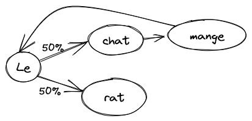

Vous avez sûrement entendu parler de ChatGPT de OpenAI, ou de ses alternatives
GPT-3, GPT-4, Bing Chat de Microsoft, LLaMa de Facebook ou encore Bard de
Google. Ce sont des programmes d'intelligence artificielle qui simulent une
conversation. Remarquablement intelligents, ils peuvent parfois passer pour des
humains, et sont compétents dans une grande variété de tâches, de la
dissertation à l'écriture d'un site web.

Comment est-ce qu'un ordinateur peut arriver à tenir une conversation pareille?
Déconstruisons son fonctionnement.

# Une approche probabiliste

Le plus simple des modèles d'un langage est le modèle bêtement probabiliste,
aussi connu sous le nom de chaîne de Markov[^iphone_model]. Le principe est simple: on prend
un texte de référence, plus il est long mieux c'est, et on apprend les
probabilités de séquences de mots. Par exemple, étant donné la phrase:

[^iphone_model]: C'était le premier modèle utilisé dans les claviers d'iPhones
  pour prédire le prochain mot de la phrase.

> Le chat mange le rat.

Le modèle va apprendre qu'après "chat" il y a toujours "mange", puis "le". Par
contre, après "le", il y a une chance sur deux d'avoir "chat" et une chance sur
deux d'avoir "rat". On peut utiliser ce modèle pour demander quel est le
prochain mot d'une phrase incomplète. Si on répète ce processus, on peut
générer des phrases entières.

Si on demande à ce modèle de générer une phrase, on peut
avoir exactement la même chose que ce qu'on a entré:

> Le chat mange le rat.

Mais on pourrait aussi avoir:

> Le rat.
>
> Le chat mange le chat mange le chat mange le rat.

À chaque fois qu'on atteint le mot "le", le modèle a le choix entre continuer
avec "rat" ou "chat".

Bien sûr, le texte qu'on utilise pour entraîner le modèle est beaucoup trop
court, mais on voit déjà les défauts. Si on l'entraîne sur tout le texte de
Wikipédia, on pourrait avoir quelque chose comme:

> Expliquant ses actions, et admit à l'hôpital psychiatrique à cause de la
> langue et la culture de David.[^markov_quote]

[^markov_quote]: https://medium.com/@inzaniak/markov-chains-on-wikipedia-98d472421719

La phrase est plus complexe, le vocabulaire plus riche, mais ça n'a aucun sens
parce que le modèle n'a aucun _contexte_: il utilise uniquement le mot
précédent pour générer le suivant. On pourrait étendre le modèle à 2, 3 ou 4
mots de contexte ("mange le" est suivi de "rat"), mais on risque de ne faire
que copier des passages entiers du texte source: combien de fois y a-t-il la
même séquence de 4 mots sur Wikipédia?

# Passer des mots au sens

Un des problèmes qu'on a jusqu'ici est qu'on est fixés sur les mots comme
groupes de lettres, sans essayer de les comprendre. Le modèle ne fait aucun lien
entre "le" et "un", entre "roi" et "reine", etc. Comment extraire le sens des
mots? Essayer d'expliquer et de définir les mots à un ordinateur est une
impasse, la tâche est beaucoup trop complexe. Comment même représenter le sens
d'un mot? L'ordinateur comprend une chose très bien: les nombres. Et si on
représentait le sens d'un mot comme des nombres sur plusieurs échelles?

Par exemple: de -1 (masculin) à 1 (féminin), comment évaluer ce mot?
 - roi: -1
 - reine: 1
 - table: 0
 - moustache: -0.9

Ou: de -1 (méchant) à 1 (gentil), comment évaluer ce mot?
 - loup: -0.8
 - princesse: 0.9
 - table: 0.1
 - cadeau: 1

Ou encore: de -1 (nom) à 1 (verbe), comment évaluer ce mot?
 - roi: -1
 - parler: 1
 - joli: 0

Et ainsi de suite. Avec suffisamment d'axes sur lesquels évaluer les mots, on
devrait pouvoir obtenir une approximation du sens du mot. Le problème
maintenant est: comment choisir les axes, et comment évaluer tous les mots?
Encore une fois, la tâche étant complexe, on va laisser l'ordinateur faire tout
seul: si on lui dit que les mots qui apparaissent fréquemment ensemble sont liés,
et qu'on lui donne beaucoup de texte, l'ordinateur peut déterminer tout seul
les axes et leur évaluation. Dans notre exemple avec le chat et le rat, les
deux sont des animaux, et c'est utile de savoir qu'ils mangent tous les deux.
Mais dans un livre de mathématiques, il n'y aura pas de chat ni de rat, parce
que leur sens est loin du sens des mots utilisé dans le texte.

Les axes qu'on obtient seront souvent difficiles à expliquer: on va sûrement
retrouver quelques axes courants (comme masculin/féminin) mais beaucoup seront
plus complexes, n'aurons de sens que combinés avec d'autres axes, ou
représentent plusieurs concepts à la fois.

Cette méthode est connue sous le nom de plongement lexical, ou vectorisation
de mots ("word embedding").

# Du sens aux relations

Maintenant qu'on a notre sens sous forme de nombres, on peut utiliser des
propriétés intéressantes: on peut les ajouter, par exemple. Ça veut dire quoi
ajouter deux mots? Eh bien, en ajoutant "France" et "monnaie" (ou plutôt en
ajoutant les nombres qui leur correspondent), on va obtenir "euro" (ou plutôt
des nombres qui sont proches des nombres pour "euro"). "France" + "capitale" =
"Paris", "manger" + "nom" = "repas", et ainsi de suite.

Mais on peut aussi soustraire! Par exemple: "roi" - "homme" + "femme" =
"reine", ou encore "Paris" - "France" + "Angleterre" = "Londres".

On peut aussi trouver les mots les plus proches, les synonymes.

# Apprendre ces relations?

En utilisant cette représentation des mots, on peut reprendre notre modèle
initial, mais cette fois-ci en apprenant des relations au lieu des mots.
Cependant, les relations étant plus complexes, on aura besoin de plus de
contexte. Heureusement, maintenant qu'on a des nombres, on peut utiliser des
approximations! Au lieu de se dire "_après "chat", il y a "mange"_", on peut
apprendre des relations comme: "_après un article et un nom, il y a souvent un
verbe_" et "_les animaux ont besoin de manger, boire et courir_" et "_les rats sont
plus petits que les chats_" et "_on ne peut manger que des choses plus petites
que soi_". Le tout, exprimé avec des nombres.

Ces relations sont complexes, donc il faut beaucoup de texte pour entraîner le
modèle. Les relations sont exprimées sous la forme d'une équation, du genre
$y = a \cdot x_1 + b \cdot x_2 + c$,
mais avec beaucoup plus de variables (les $x_1$) et de paramètres ($a$, $b$ et
$c$). Au lieu de suivre des probabilités de mot en mot, on va avoir une équation
pour chaque axe sémantique qu'on utilise (par exemple masculin/féminin). Au
total, le modèle a plusieurs centaines de milliards, voir billions de
paramètres! Ça lui permet de prendre en compte un contexte plus large:
 - Une vingtaine de mots lui permettraient de construire des phrases simples
   qui ont une structure correcte.
 - Une centaine de mots lui permettraient d'élaborer une idée sur un petit
   paragraphe.
 - Avec un millier de mots, il peut avoir une conversation sans perdre le fil.
 - Les plus gros modèles ont un contexte de l'ordre de 20 000 mots, ce qui leur
   permet de pouvoir lire un article complet, une histoire courte, ou avoir une
   longue conversation et pouvoir tout prendre en compte au moment de générer
   le mot suivant.

Au final, tout est une question de taille: un modèle plus gros peut apprendre
plus de relations, et prendre en compte plus de contexte.

# Quelles sont les forces et les faiblesses de GPT?

GPT est très compétent pour générer du texte qui a l'air d'avoir été écrit par
un humain. Il est capable d'enchaîner des idées de manière logique, de les
défendre, de réagir au contexte, et (surtout la dernière génération GPT-4)
d'éviter de se contredire.

Cependant, il a aussi tendance à mentir, ou plutôt à laisser courir son
imagination lorsqu'il ne sait pas. Lui demander le résultat d'un calcul
mathématique, c'est courir le risque d'obtenir une réponse très approximative,
voir complètement fausse. Son apprentissage étant limité aux textes étant
disponible en septembre 2021, il risque d'inventer pour tout ce qui concerne
l'actualité. Pour tenter de pallier ça, Bing Chat et Google Bard lient le
modèle à un moteur de recherche (Bing ou Google) pour lui permettre d'obtenir
des informations plus récentes.

Pour utiliser GPT de manière productive, il est essentiel de l'appliquer à des
tâches qui sont soit approximatives (générer un email de marketing?) et les
erreurs n'ont pas grande importance; soit facilement vérifiables que ce soit
par un programme (non IA!) ou en ajoutant un humain dans la boucle.

# Est-ce que le modèle peut penser?

La première réponse, maintenant qu'on sait ce qui se passe à l'intérieur, c'est
non: le modèle n'est une grosse équation mathématique qui génère des
probabilités pour le prochain mot d'une phrase.

Cependant, ça vaut le coup de considérer notre propre cerveau: nous avons un
réseau de neurones (100 milliards) connectés les uns aux autres (10 000
connections par neurones), qui réagit au contexte, apprend de son expérience,
et génère une réponse appropriée (mais souvent difficile à prédire exactement).
En d'autres termes, à part le fait que notre algorithme est chimique plutôt que
digital, la structure est similaire.

Quelles sont les différences?
 - 3 ordres de grandeurs de complexité: le cerveau humain a 1000 fois plus de
   connections que GPT-4 n'a de paramètres. Ça lui permet de représenter des
   situations plus complexes.
 - Apprentissage continu: le cerveau continue toujours à apprendre, y compris
   au cours d'une conversation, alors que GPT a fini son apprentissage avant le
   début de la conversation.
 - Limité aux mots: l'interface de GPT ne fait que générer des mots. Cependant,
   il y a toute une composante sémantique à l'intérieur, qui est transformée
   en mots à la dernière étape. Il est tout à fait concevable d'entrainer un
   modèle à contrôler un robot (étant donné suffisamment de données
   d'entraînement).
 - Perception sensorielle limitée: la seule chose que GPT perçoit est le texte de
   la conversation. Jusqu'à 60% de la communication est non verbale: le ton, le
   rythme de la voix, l'expression du visage, même des facteurs subconscients
   comme l'odeur jouent un rôle. GPT rate toute cette partie.

D'autres différences qu'on pourrait citer sont plutôt au niveau du
comportement:
 - GPT a du mal à appliquer des règles logiques de manière cohérente;
   ironiquement, il ne sait pas faire de maths. Mais cela est comparable à un
   jeune enfant.
 - GPT n'a pas d'émotions: les émotions chez les humains impliquent beaucoup de
   glandes et d'hormones avec une interaction complexe avec le cerveau.
   Cependant, GPT a appris les comportements associés avec des réactions
   émotionnelles grâce à des conversations entre humains. Il est capable de se
   comporter comme s'il avait des émotions, est-ce que ça compte? Des extraits
   de conversations montrent que GPT agit comme s'il avait conscience d'être
   un programme, et se pose parfois des questions existentielles.
 - Selon certains, GPT n'est pas conscient. La définition de conscience a
   souvent évoluée, et dépend de la personne; elle est souvent définie de
   manière que seuls les humains aient une conscience. Si un programme agit
   de manière indistinguable d'un être humain, est-ce qu'on va reconnaître qu'il
   a une conscience? L'argument de la Chambre Chinoise[^chinese_room] veut le
   contraire: si c'est possible de passer pour un Chinois en ne faisant que
   suivre des instructions à la main sans parler chinois soi-même, alors un
   ordinateur qui ne fait "que suivre ses instructions" ne comprend pas le
   chinois, et par extension n'est pas conscient.

[^chinese_room]: [Chambre Chinoise sur
  Wikipédia](https://fr.wikipedia.org/wiki/Chambre_chinoise)

# Quelles sont les conséquences pour la société?

Je ne suis pas capable de prédire le futur, surtout au début d'une technologie
révolutionnaire, mais c'est en effet une technologie révolutionnaire. Pour
beaucoup de métiers du savoir, du marketing au programmeur, des entretiens
d'embauche au soutient pour arrêter de fumer, GPT va changer la donne. De la
même manière que le travail à la chaîne a changé le travail d'artisan, que les
calculatrices et ordinateurs ont changé le travail de comptable, que les médias
de masse ont changé la politique, GPT va changer le monde de l'employé de
bureau.

Certes, tous ces métiers ne vont pas disparaître du jour au lendemain, mais là
où on avait besoin d'une équipe de marketing de 10 personnes pour une boîte
moyenne, peut-être qu'une ou deux personnes armées de GPT peuvent faire le
même travail.

Comme beaucoup d'avancées scientifiques et/ou industrielles, ce changement va
affecter beaucoup de gens: certains vont devoir se reconvertir, apprendre à
utiliser GPT pour l'intégrer à leur job, et d'autres vont perdre leur boulot.
Des emplois vont aussi être créés directement par GPT (comme celui de "Prompt
Engineer", quelqu'un qui "sait parler à la machine") et d'autres indirectement
en facilitant la création de produits, d'entreprises et ainsi de suite.

C'est difficile de savoir quelles vont être les conséquences, mais nous sommes
dans le début d'une phase où beaucoup de choses vont changer, où les personnes
avec des compétences techniques ont un avantage, et où les entrepreneurs ont un
champ de possibilités grand ouvert. D'un autre côté, beaucoup de gens qui ne
sont pas prêts à changer, qui n'ont pas les compétences ou qui ne peuvent pas
se permettre de se reformer sont menacés.

# Est-ce que GPT va détruire la société?

Certains craignent la fin du monde à cause de l'IA: de Matrix à Terminator,
c'est un thème préféré de la science-fiction. En général, les deux scénarios
possibles sont:
 - le scénario Terminator: L'IA est créée à des fins militaires, par exemple par
   un dictateur, et est dotée d'un instinct de conservation: essayer de
   l'arrêter c'est la menacer, et elle réagit violemment.
 - l'optimisation de trombones: dans cette parabole, une IA est chargée de
   produire autant de trombones que possible. Après avoir épuisé les réserves
   de fer de la planète, elle se tourne vers d'autres sources de carbone: les
   humains. Une autre version voit les humains essayer d'arrêter la machine; la
   machine se rend compte que pour pouvoir construire des trombones en paix, il
   lui faut éliminer les humains. C'est un peu comme le génie qui détourne ton
   souhait en te donnant exactement ce que tu as demandé plutôt que ce que tu
   voulais.

Une chose dont il faut se rendre compte est que (pour l'instant) GPT ne peut
que produire du texte. Bien sûr, le texte entre de mauvaises mains peut être
dangereux (après tout, un dictateur ne fait "que parler"), mais tout seul, GPT
ne peut rien faire. Cependant, ça peut être le premier pas vers un système
capable de plus: un dérivé de GPT mis dans un robot, un assistant de décision
militaire, etc.

Il va falloir avancer avec prudence, et intervenir au cas où les progrès sont
incontrôlables, ou incontrôlés. Heureusement, des experts en IA étudient la
question de près, il existe peut-être un chemin sûr vers le progrès.
